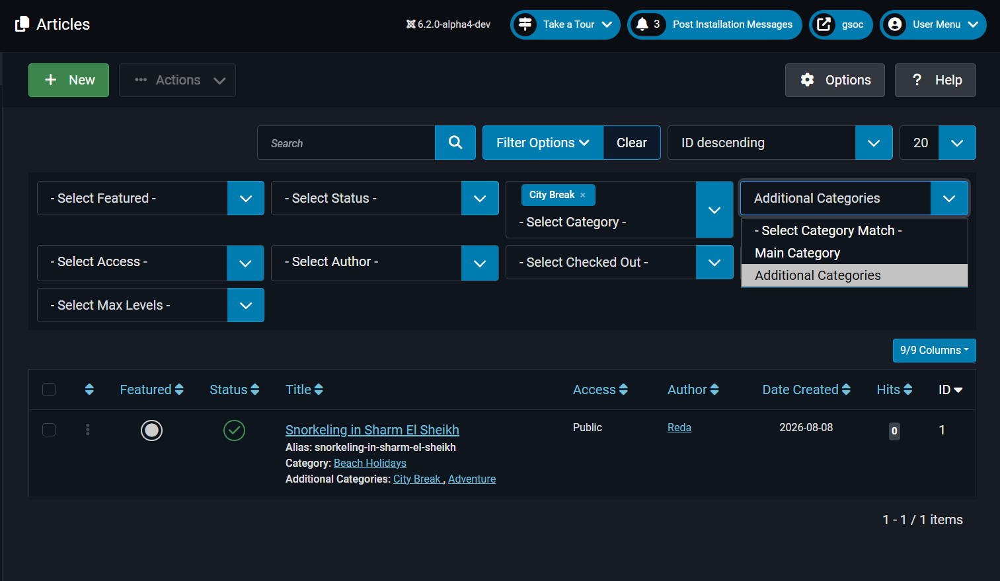
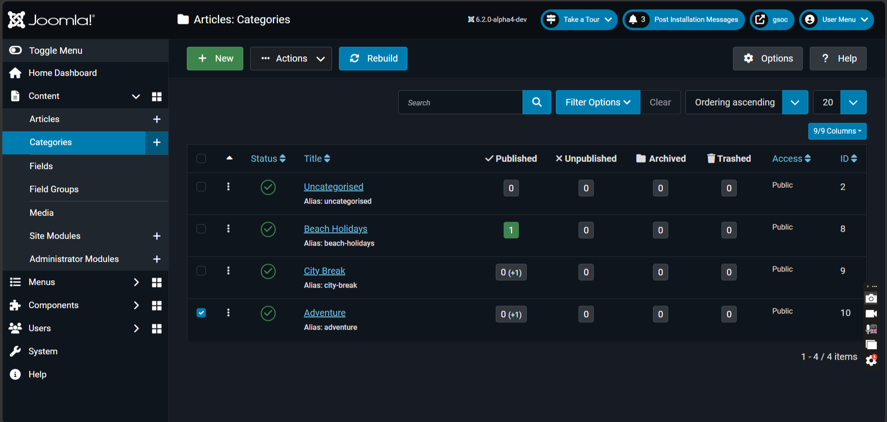
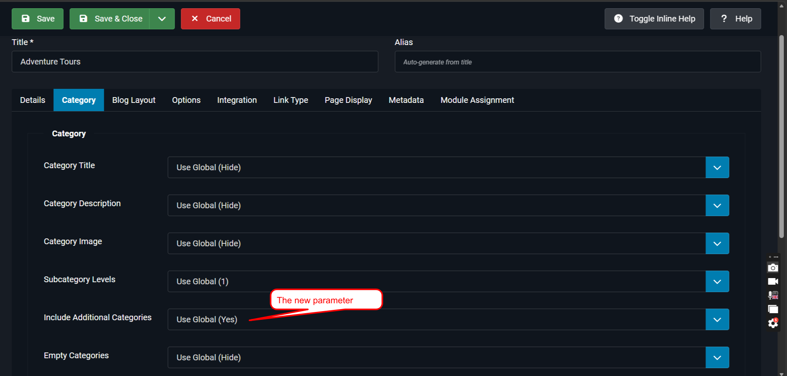
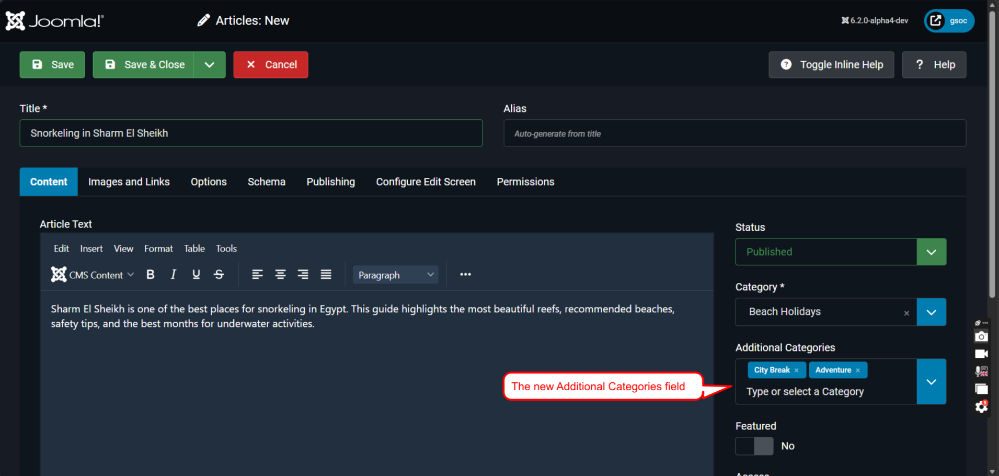
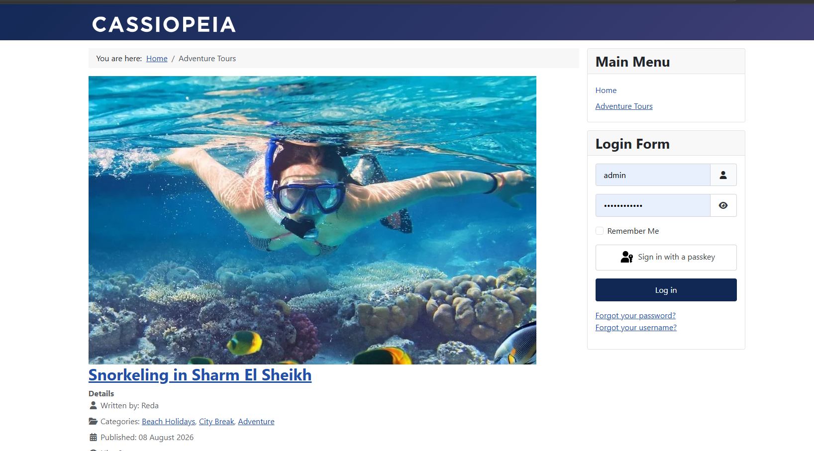
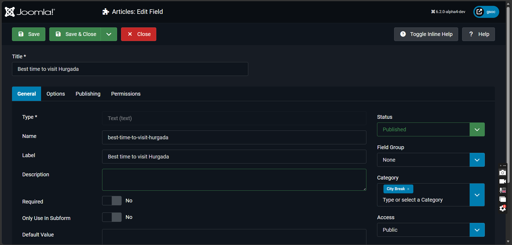
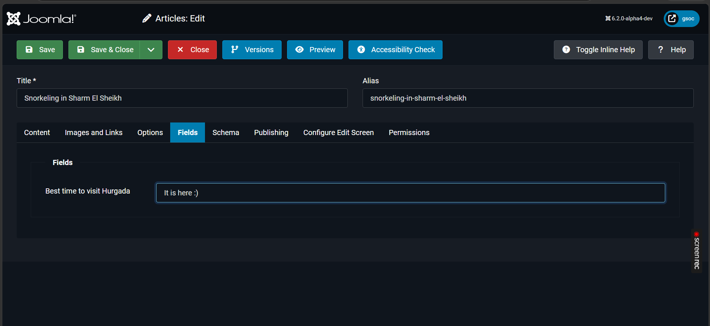

# Additional Categories

> This documentation describes a planned Joomla feature. It is not available in Joomla core until the feature is merged.

## Introduction

An item can have one **Category** and one or more **Additional Categories**.

The Category is the main category of the item. Additional Categories are extra places where the item can be listed.

For example, an article can have **Europe** as its Category and **Summer Trips** as an Additional Category. The article can be displayed in both category views.

Additional Categories are available for Articles, Contacts, Banners, and News Feeds.

## Add Additional Categories

To add Additional Categories to an item:

1. Open the item for editing.
2. Select the main category in the **Category** field.
3. Select one or more categories in the **Additional Categories** field.
4. Select **Save** or **Save & Close**.

The main category cannot also be selected as an Additional Category.

> The Article edit form. Show the **Category** and **Additional Categories** fields. The image should show one main category and two selected additional categories.

## Filter Items by Category

The Articles, Contacts, Banners, and News Feeds lists have a **Category Match** filter.

First select a category. Then select one of these options in **Category Match**:

| Option | Result |
| --- | --- |
| Main Category | Shows items that use the selected category as their main category. |
| Additional Categories | Shows items that use the selected category as an Additional Category. |

> An Administrator item list. Show the Category filter and the **Category Match** list with **Main Category** and **Additional Categories**.

## Category Item Counts

The Category Manager shows the number of items in the main category and the number of items in Additional Categories.

For example, `10 (+5)` means:

- `10` items use this category as their main category.
- `5` items use this category as an Additional Category.

The extra number can be shown for published, unpublished, archived, and trashed items.

> The Category Manager list showing an item count such as `10 (+5)`.

## Include Items in Category Views

Article and Contact Category Blog and Category List menu items have an **Include Additional Categories** option.

| Setting | Result |
| --- | --- |
| Yes | Shows items where the current category is the main category or an Additional Category. |
| No | Shows only items where the current category is the main category. |

Joomla checks the category state, language, and access level before it shows an item through an Additional Category.

> The Options tab of an Article Category Blog menu item. Show **Include Additional Categories** set to **Yes**.

## Additional Categories on the Site

Additional Categories are used in these frontend views:

| Area | What happens |
| --- | --- |
| Article Category Blog and Category List | An article can appear when the selected category is its main category or an Additional Category. |
| Featured Articles | An article can be selected through an Additional Category. |
| Archived Articles | An article can be selected through an Additional Category. |
| Smart Search | An article can be found through an Additional Category. |
| Contact Category views | A contact can appear when the selected category is its main category or an Additional Category. |

The view only shows items and categories that the visitor is allowed to see.

> An Article Category Blog page. Show an article whose main category is different from the current category and which appears because it has the current category as an Additional Category.

## Show Categories on the Site

Article and Contact pages can show a single **Categories** line.

When **Include Additional Categories** is enabled, the line shows the main category and the Additional Categories. When it is disabled, it shows only the main category.

The Articles module also shows the main category and accessible Additional Categories when its **Category** option is enabled.

Article page navigation also uses Additional Categories. Previous and next article links follow the category view that the visitor is using.

## Custom Fields

Custom fields can be assigned to categories.

Articles and Contacts can use custom fields from their main category and from their Additional Categories. The user must have access to the category and the custom field.

> A custom field assigned to a category, followed by an article that uses the category as an Additional Category and shows the field.

## Guided Tours

The guided tours for Articles, Contacts, Banners, and News Feeds include an **Additional Categories** step. Start a tour from **Take a Tour** in the Administrator.
